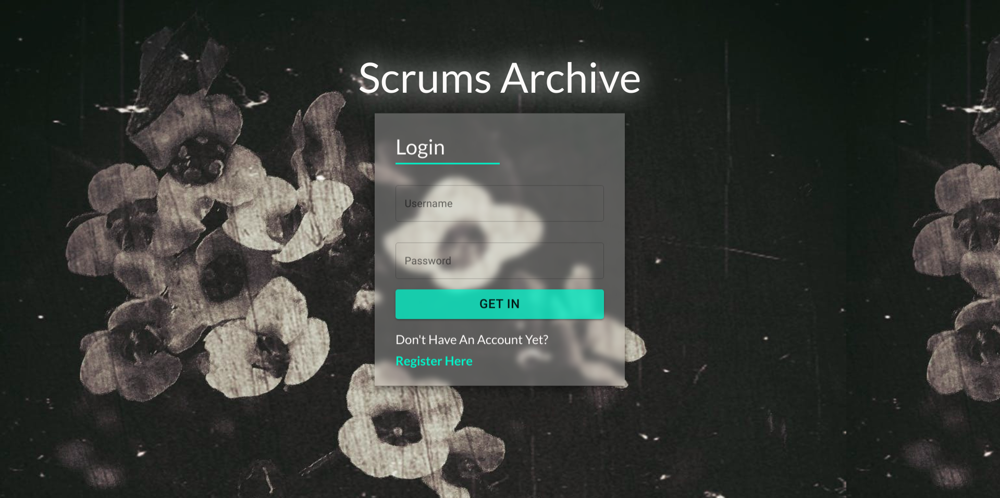
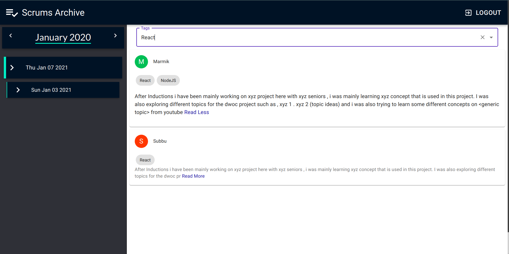

# scrums-manager

A MERN Stack Site which can be used to keep track of all the Scrum Updates.
People can Filter Based on Tags so it is easier to read topics of intrests.
Once A Scrum page is created users can go and post there updates there.
Side Bar contains History of all the scrums till now.

### Login

### Dashboard

## Frontend

-   cd frontend and `npm i`
-   `npm run start`

## Backend

-   cd backend and `npm i`
-   see the `.example.env` and create the `.env`
-   `npm run dev` to start dev server
